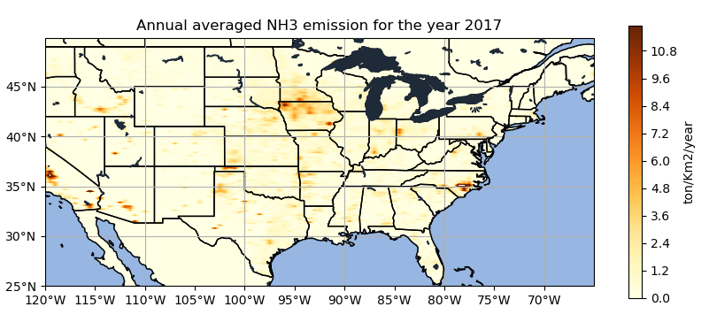
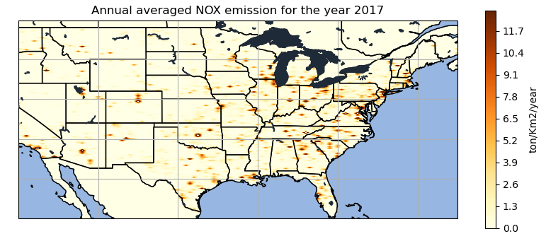
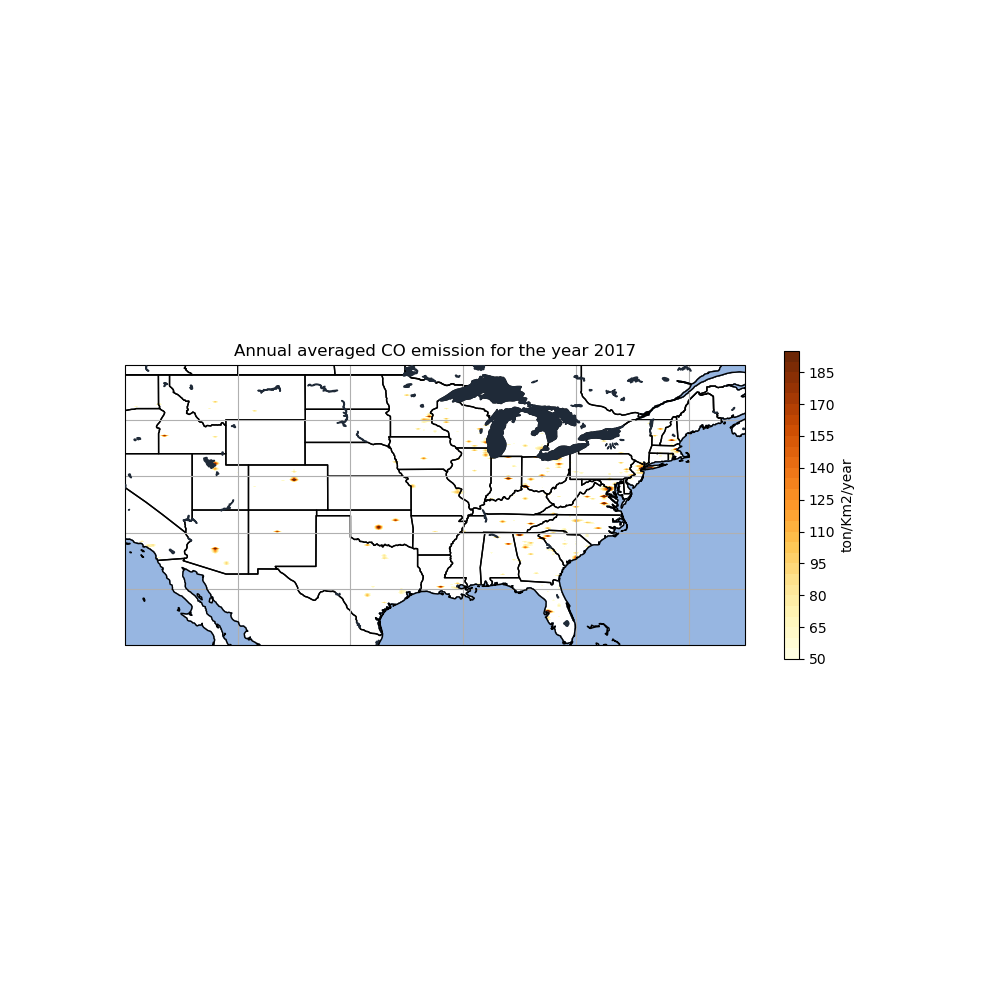
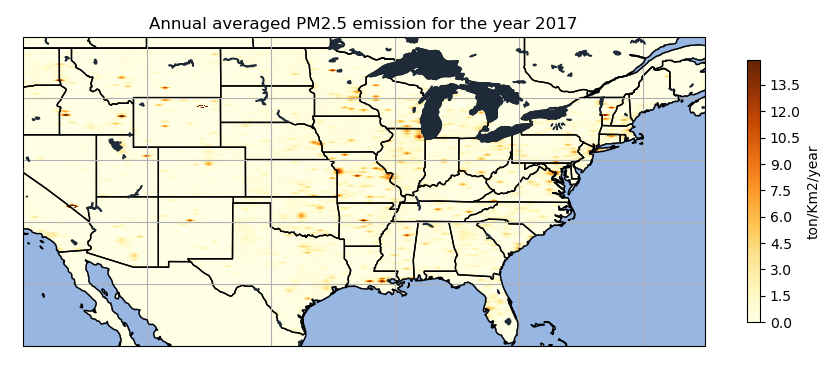

<h1 id="EMISSION MAPPING FOR MULTISPECIES OF ATMOSPHERIC POLLUTANTS OVER THE CONUS">EMISSION MAPPING FOR MULTISPECIES OF ATMOSPHERIC POLLUTANTS OVER THE CONUS</h1>
<h1 id="by-aashma-acharya">By Aasma Acharya</h1>

<h1 id="introduction">Introduction</h1>

It is significant to track the emissions of harmful gaseous and particulate matter such as NOX, SO2, CO, NH3 and PM2.5 as these pollutants, including greenhouse gasses, are significant climate forcers. The data I am using for my project represents the point source emissions of air pollutants and the climate forcers gasses collected from different inventories over the CONUS and aggregated to extract the final annually averaged emission for the entire CONUS.My CLIM680 project will explore the emission pattern for different species of atmospheric pollutants basically to see how the emission varies spatially within the CONUS. This project will analyze annual total emissions for  NOx, PM2.5,CO, and NH3 measured in terms of ton/km2/yr. This is a qualitative analysis to understand the spatial distriution of anthropogenic emission over the united states.

The most significant and thoroughly investigated air pollutants are ozone, nitrogen dioxide (NO2), and PM2.5 (O3). According to assessments, PM2.5, or particulate matter with a diameter of less than 2.5 m, is one of the main pollutants that cause harmful health impacts.

<h1 id="data">Data</h1>

The datasets used in my project is Neighborhood Emission Mapping Operation (NEMO) dataset:

This data contains annual total emission of VOCs, NOx, PM2.5, SO2, CO, and NH3 by sector in NetCDF format. The anthropogenic emissions in this dataset are generated based on the 2017 National Emissions Inventory (NEI2017) from the US Environmental Protection Agency (US EPA). It has one aggregated emission value for a year over different spatial locations since the NEI only provides aggregate emissions for each county  and the emissions are presented in the unit of ton/km2/year. The emission data are mapped at 1 km spatial gridding and at hourly intervals and the corresponding geo-registration that provides the latitude and longitude is provided by different xarray dataset.The source sector of these emissions are anthropogenic fugitive dust (afdust), agriculture (ag),nonpoint (nonpt), oil and gas operations (np_oilgas), onroad, nonroad, rail, residential wood combustion (rwc), and airports. 

<a href="http://air.csiss.gmu.edu/aq/US01emis/">Link to dataset description</a>

<h3 id="regriding(spatial interpolation)"> Regridding(Spatial Interpolation)</h3>

My dataset is in irregular grids with 3177 values of Row and 5397 values of column for the corresponding latitudes and longitudes. This means that the latitudes aren't the same for all longitudes and the longitudes aren't the same for all latitudes. So I have re-gridded my data set at first. I used a bilinear regrid method for this. Bilinear interpolation (grid Method.BILINEAR) calculates the value for the destination point as a combination of multiple linear interpolations, one for each dimension of the Grid. This method is simply linear interpolations, first along the x-axis and then along the y-axis. The weighting for the interpolation is given by the area ratio of the four rectangles splitted by the grid node to their area sum.

<h3 id="spatial variation">Spatial Variation</h3>

I have looked at the contour plots for the dataset to observe the spatial variation of the variables in my dataset to understand how the emission variation is changing with the space. I couldn't include the temporal variation cause the dataset I had is yearly aggregated.

<h3 id="function-creation">Function creation</h3>
 
A function was created to regrid the ireggular grids of the dataset and to come up with the spatial distribution representation, labeled as the below mentioned names in the list. This is in addition to the clim680 function generated in class to calculate xyticks.

                         

Xe. Regridder function : I have used one of the ESMF regridding functionality for my dataset.

 X-array-dataset.reset.coords: It changes or reset the coordinates into variables. In this project scenario this function is used to change the lat and lon which was under the data variable section to reset them as coordinates.

 X-array.DataArray.to_dataset : It basically converts input dataset to time lagged dataset. It is used for converting a DataArray to a DataSet.

Arrange() :  It's the function used to return evenly spaced values within the given interval.

gridlines(): It's simply  used to configure the gridlines.

<h1 id="results and analysis">Results and Analysis </h1>
<h3 id="project-notebook-via-github">Project Notebook via Github</h3>

Located within my aachar5.github.io repository is a series of jupyter notebooks that contain all of the labeled and commented code that was used in my analysis. 
<a href="https://github.com/aachar5/aachar5.github.io/blob/a8472adaaa9a440c7bf449b79f8aa2610af54b15/finalsubmission.ipynb">Link to dataset</a>

 following are the spatial variabiltity for the anthropogenic pollutant species such as NH3, NOX, CO and PM2.5.

 

 
Higher urban NH3 emissions is observed around LA and Santa Barbara of California more than about 10.8 ton/km2/year. Studies suggest that most of the urban ammonia comes from not only nearby fertilizer use but the vehicular emission also contributes.  Similarly, higher NH3 emissions in Arizona, north-western and south-eastern Iowa, Southern-Minnesota, and south-eastern part of North-Carolina can be observed from the given plot.

 
NOx is one of the precursors for the formation of ozone. The plot is giving point source information for the emission of NOX.  The east-coast seems to have maximum about of the NOx emission for the year 2017. While California and Arizona in the west-coast is showing considerable amount of emission more than 11.7 ton/km2/year. The north-central part of Colorado has a high intensity blob depicting maximum amount of NOX emission for a point source emission.

 
The CO emission is observed exactly in the same place as NOX emission was observed in north-central Colorado. Similarly, considerable amount of CO emission can be observed around the south of great Salt Lake at Utah. There is a blob observed in central Oklahoma showing emission higher that 185 ton/km2/year. The east-coast is showing higher emission for CO compared to the spatial distribution on the west-coast.

 

 
In the west coast significant emission can be observed in the eastern and the western part of southern Idaho.  Similarly, considerable amount of PM2.5 emission over 13 ton/km2/year can be observed in the Kansas City of Missouri. Also, Same level of PM2.5 emission can be seen in the plot where there is Chicago and most southern and central part of Vermont shows significant amount of Pm2.5 emission in the year 2017.

<h3 id="conda-environment">Conda Environment</h3>

The environment.yml file is shown to define the environment needed to run all code successfully.

 <h1 id="discussion and future Work">Discussion and Future Work</h1>
 
Since the data is on an irregular grid it takes a lot of time to regrid for each variable one by one. The regriding took a lot of time and often collapsed the kernel. This is the challenge that comes up while interpolating irregular grids. The data is only of 2017 yearly averaged and aggregated into a one value representing yearly emission for 2017. If there will be access to aerosol concentration data over the CONUS , correlation analysis can be performed in future to study the changes in anthropogenic aerosol whose precursors are NH3, NOX, CO and PM2.5.  Since this is point source data, it will be better to analyze a specific state emission with the data rather than for a whole state at once.

<h1 id="references">References</h1>

Archibald, A. T., Folberth, G., Wade, D. C., & Scott, D. (2017). A world avoided: Impacts of changes in anthropogenic emissions on the burden and effects of air pollutants in Europe and North America. Faraday Discussions, 200(0), 475–500. https://doi.org/10.1039/C7FD00004A

Ma, S., & Tong, D. Q. (2022). Neighborhood Emission Mapping Operation (NEMO): A 1-km anthropogenic emission dataset in the United States. Scientific Data, 9(1), Article 1. https://doi.org/10.1038/s41597-022-01790-9

ESMPy: ESMF Python Regridding Interface. (n.d.). Earth System Modeling Framework. Retrieved December 10, 2022, from https://www.earthsystemmodeling.org/esmpy/

